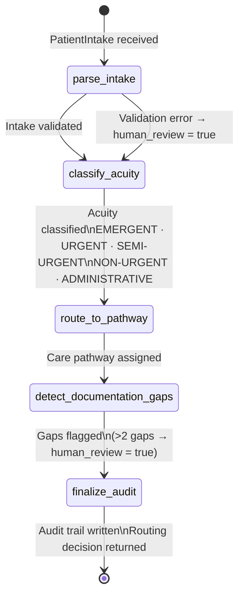

# Clinical Triage Agent

> **LangGraph + Pydantic AI** — Epic In-Basket logic rebuilt as an agentic triage system

[]()
[]()
[]()
[]()

## The Problem

Epic In-Basket is one of the most overloaded workflows in healthcare. Nurses and MAs spend hours triaging messages that could be intelligently routed, prioritized, and pre-drafted by an AI system. This agent models that triage logic as a structured, stateful pipeline.

## What It Does

A stateful triage agent built with LangGraph and Pydantic AI that:
- Accepts incoming patient messages (simulating In-Basket input)
- Classifies urgency, message type, and required action
- Routes to the appropriate care team role
- Drafts a suggested response for clinician review
- Validates all outputs against a typed Pydantic schema



## Tech Stack

| Layer | Technology |
|---|---|
| Agent Framework | LangGraph |
| Data Validation | Pydantic AI |
| LLM | OpenAI GPT-4 |
| Language | Python 3.11+ |

## Epic In-Basket Workflow Context

This agent models the real governance logic behind Epic In-Basket triage — the most overloaded workflow in ambulatory care. In production Epic environments, In-Basket message routing follows a strict taxonomy and escalation hierarchy that this agent replicates as a stateful LangGraph pipeline.

### Message Type Taxonomy
| Message Type | Default Route | Escalation Trigger |
|---|---|---|
| Clinical Advice Request | RN Pool | Symptom severity → provider |
| Rx Refill Request | MA Pool | Controlled substance → provider |
| Test Result Notification | Ordering Provider | Critical value → immediate |
| Scheduling Request | Front Desk | Urgent complaint → clinical |
| Administrative | Front Desk | None |

### Acuity-to-Pathway Mapping
| Acuity Level | Care Pathway | SLA |
|---|---|---|
| `EMERGENT` | Emergency Department — immediate physician notification | Immediate |
| `URGENT` | Acute Care — nurse assessment | Within 30 min |
| `SEMI-URGENT` | Same-Day Scheduled — provider queue | Within 4 hrs |
| `NON-URGENT` | Routine Scheduled — next available | Within 72 hrs |
| `ADMINISTRATIVE` | Front Desk — non-clinical resolution | Standard |

### Documentation Governance
The agent enforces the same 5-field completeness check required before Epic In-Basket routing closes:
- Vital signs documented
- Allergy status confirmed
- Medication reconciliation complete
- Reason for visit documented
- Insurance verification status

> More than 2 missing fields triggers `requires_human_review = True` — matching the MA escalation threshold in Epic workflow governance.

---

## Epic FHIR Production Integration Path

Connecting this agent to a live Epic environment requires the following:

| Integration Point | FHIR Resource | Epic API |
|---|---|---|
| Inbound patient messages | `Communication` | MyChart Messaging API |
| Work item routing | `Task` | In-Basket Task API |
| Patient demographics | `Patient` | R4 Patient resource |
| Encounter context | `Encounter` | R4 Encounter resource |
| Allergy verification | `AllergyIntolerance` | R4 AllergyIntolerance |

**Auth:** SMART-on-FHIR Backend Services (system-to-system, no user login required)  
**Sandbox:** [Epic on FHIR Sandbox](https://fhir.epic.com) — free registration, full R4 resource access  
**App Registration:** Non-Patient-Facing Application registration via Epic's vendor portal

## Getting Started

```bash
git clone https://github.com/jsfaulkner86/clinical-triage-agent
cd clinical-triage-agent
python -m venv venv
source venv/bin/activate  # Windows: venv\Scripts\activate
pip install -r requirements.txt
cp .env.example .env
python main.py
```

## Environment Variables

```
OPENAI_API_KEY=your_key_here
```

## Background

Built by [John Faulkner](https://linkedin.com/in/johnathonfaulkner), Agentic AI Architect and founder of [The Faulkner Group](https://thefaulknergroupadvisors.com). Directly informed by In-Basket workflow design and clinical operations experience across 12 Epic enterprise health systems.

## What's Next
- Epic MyChart message integration via FHIR
- Escalation agent for high-urgency triage paths
- Feedback loop for clinician response training data

---
*Part of a portfolio of healthcare agentic AI systems. See all projects at [github.com/jsfaulkner86](https://github.com/jsfaulkner86)*
